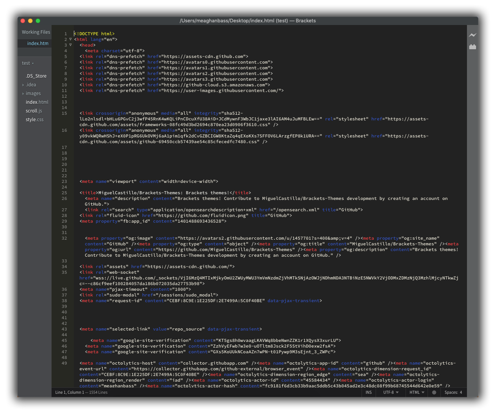
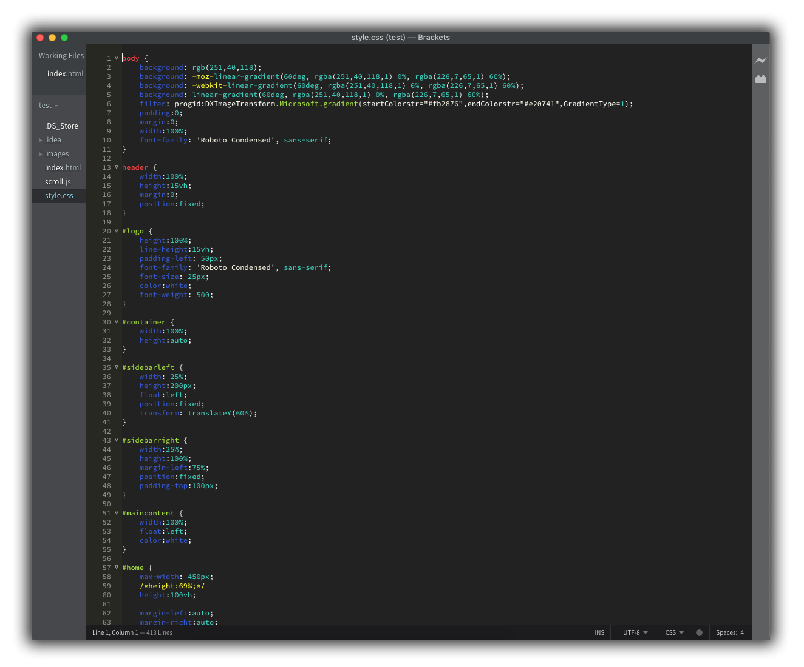
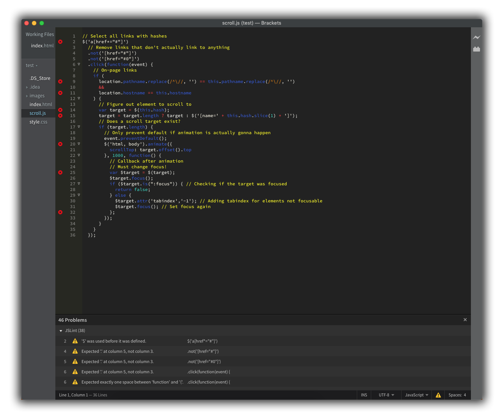

Brackets Theme: Americana
===

Screenshots
---

### HTML

### CSS

### JavaScript

Installation
---

This extension requires Brackets Release 1.0 or newer.

1. Download .zip folder, unzip
2. Within Brackets, navigate to Help >Show Extensions Folder
3. Open "user" folder
4. Copy "Americana_theme-master" folder and paste into "user" folder
5. Close folder
6. Navigate to View > Themes...
7. Select Americana
8. Click Done

License
---

The MIT License. Read [LICENSE](LICENSE) for further information.
